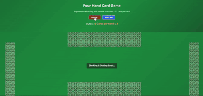

# 🎴 Card Shuffle Game

A beautifully designed and interactive card shuffling game built using **React (with TypeScript)** and **Vite**. This project showcases a smooth card fan-out animation, inspired by real-world card handling, perfect for desktop interfaces.

---
## 📁 Shuffling Preview

<p align="center">
  
</p>


## 📁 Folder Structure

```
CARD-SHUFFLE-GAME/
├── public/                  # Static files
├── src/                    # Main source code
│   ├── assets/             # Image and static assets
│   ├── components/         # Reusable React components
│   ├── utils/              # Utility functions and helpers
│   ├── App.tsx             # Root component
│   ├── App.css             # Component-specific styles
│   ├── index.css           # Global styles
│   ├── main.tsx            # Entry point
│   └── vite-env.d.ts       # Vite environment definitions
├── index.html              # HTML template
├── .gitignore              # Files/folders to ignore in Git
├── README.md               # Project documentation
├── LICENSE                 # License file
├── package.json            # Project metadata and dependencies
├── package-lock.json       # Lock file for npm
├── vite.config.ts          # Vite configuration
├── tsconfig.json           # TypeScript config
└── tsconfig.*.json         # Additional TS config files
```

---

## 🚀 Getting Started

### 1. Clone the repository

```bash
git clone https://github.com/Thetourist2051/card-shuffle-game/card-shuffle-game.git
cd card-shuffle-game
```

### 2. Install dependencies

```bash
npm install
```

### 3. Start the development server

```bash
npm run dev
```

Visit `http://localhost:5173` to view the app in the browser.

---

## 🎯 Features

- 🌀 Beautiful fan-out card layout using CSS transforms
- 🛠️ Built with React, TypeScript, and Vite
- ⚙️ Easy-to-maintain file structure
- 🌈 Fully responsive design (add media queries if needed)
- 🎮 Future-ready to integrate card game logic

---

## 🧠 Technologies Used

- React 18+
- TypeScript
- Vite
- CSS3 (Flexbox, Transforms)
- Node.js & npm

---

## 📌 TODO

- [x] Static layout with fan-styled cards
- [x] Add shuffling animation
- [ ] Implement deck logic and gameplay
- [ ] Add multiplayer support
- [ ] Responsive tweaks for mobile view

---

## 🤝 Contributing

Pull requests are welcome! For major changes, please open an issue first to discuss what you would like to change.

---

## 📄 License

This project is licensed under the terms of the MIT license.

---

> Designed and developed by **Afriduzzaman** ✨

